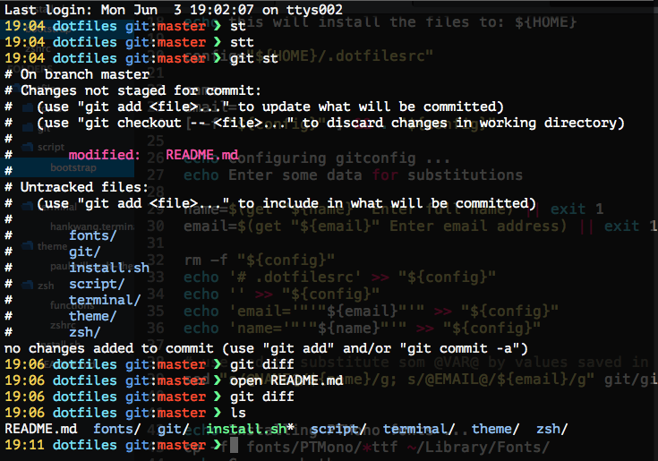
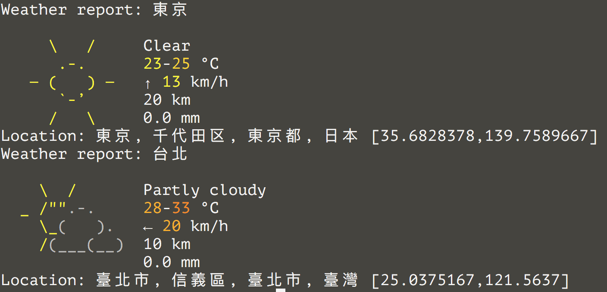

# Dotfiles

```bash
 ██░ ██  ▄▄▄       ███▄    █  ██ ▄█▀  ██████  █    ██ ▓█████▄  ▒█████
▓██░ ██▒▒████▄     ██ ▀█   █  ██▄█▒ ▒██    ▒  ██  ▓██▒▒██▀ ██▌▒██▒  ██▒
▒██▀▀██░▒██  ▀█▄  ▓██  ▀█ ██▒▓███▄░ ░ ▓██▄   ▓██  ▒██░░██   █▌▒██░  ██▒
░▓█ ░██ ░██▄▄▄▄██ ▓██▒  ▐▌██▒▓██ █▄   ▒   ██▒▓▓█  ░██░░▓█▄   ▌▒██   ██░
░▓█▒░██▓ ▓█   ▓██▒▒██░   ▓██░▒██▒ █▄▒██████▒▒▒▒█████▓ ░▒████▓ ░ ████▓▒░
 ▒ ░░▒░▒ ▒▒   ▓▒█░░ ▒░   ▒ ▒ ▒ ▒▒ ▓▒▒ ▒▓▒ ▒ ░░▒▓▒ ▒ ▒  ▒▒▓  ▒ ░ ▒░▒░▒░
 ▒ ░▒░ ░  ▒   ▒▒ ░░ ░░   ░ ▒░░ ░▒ ▒░░ ░▒  ░ ░░░▒░ ░ ░  ░ ▒  ▒   ░ ▒ ▒░
 ░  ░░ ░  ░   ▒      ░   ░ ░ ░ ░░ ░ ░  ░  ░   ░░░ ░ ░  ░ ░  ░ ░ ░ ░ ▒
 ░  ░  ░      ░  ░         ░ ░  ░         ░     ░        ░        ░ ░
                                                       ░
```

## Screenshot




## Install

```bash
sudo softwareupdate -i -a
xcode-select --install

curl -L https://raw.github.com/hanksudo/dotfiles/master/install.sh | sh
```

## Set Git user info if you use .gitconfig

```bash
git config --global user.signingkey XXXXXXX
git config --global user.email your-email-address
git config --global user.name "You Name"
```

## MacOS and Terminal Settings

```bash
~/.dotfiles/macos
```

## Note

- [homebrew - The missing package manager for OS X](http://brew.sh/)
- [ag - A code-searching tool similar to ack, but faster.](https://github.com/ggreer/the_silver_searcher)
- [autojump - a faster way to navigate your filesystem](https://github.com/joelthelion/autojump) - use `j folderName` jump to your frequency use folder.
- [sharkdp/fd: A simple, fast and user-friendly alternative to &#39;find&#39;](https://github.com/sharkdp/fd)
- [Schniz/fnm: 🚀 Fast and simple Node.js version manager, built in Rust](https://github.com/Schniz/fnm)
- [git-extras](https://github.com/visionmedia/git-extras) - GIT utilities
- [HTTPie: a CLI, cURL-like tool for humans](https://github.com/jakubroztocil/httpie)
- [thefuck - Magnificent app which corrects your previous console command.](https://github.com/nvbn/thefuck)
- [A command-line fuzzy finder written in Go](https://github.com/junegunn/fzf)
- [scmpuff makes working with git from the command line quicker by substituting numeric shortcuts for filenames](https://mroth.github.io/scmpuff/)

## Fonts

- Use [PTMono Fonts](https://fonts.google.com/specimen/PT+Mono)
- Use [Source Code Pro Fonts](https://fonts.google.com/specimen/Source+Code+Pro)

## Applications

- [iTerm2 - macOS Terminal Replacement](https://www.iterm2.com/)
- [IINA - The modern media player for macOS](https://iina.io/)
- [Notion - All-in-one workspace](https://www.notion.so/)
- [Raycast - Supercharged productivity](https://www.raycast.com/)

## Extra alias & functions

- Git alias inside **git/gitconfig**
- **bat** A cat(1) clone with wings (<https://github.com/sharkdp/bat>)
- [**eza**](https://github.com/eza-community/eza) - A modern, maintained replacement for ls
- **doctoc** - Generates table of contents for markdown files inside local git repository
- **lsd** - list only directories
- **hosts** - Quick edit /etc/hosts
- **sshc** - Quick edit ~/.ssh/config
- **emptytrash** - Empty the Trash on all mounted volumes and the main HDD
- **ip** - detect IP by remote server
- **localip** - local ip
- **ips** - IPv4 IPs
- **ports** - list all listening ports (sudo required)
- **whois** - Enhanced WHOIS lookups
- **gz** - get gzipped size
- **extract** - Extract archives - use: `extract <file>`
- **mkcd** - Make dir and cd into.
- **titler** - Auto copy web title and url as specific format
- **pip-purge** - Purge all Python3 packges
- **image** - Search on Google Image
- [**imgcat**](https://iterm2.com/documentation-images.html) - Make iTerm2 able to display images within the terminal
- **map** - Search on Google Map
- **weather** - Show weather
- **qrr** - QRCode reader (by zbarimg)
- **serve** - Serve static files
- [zmv](http://zshwiki.org/home/builtin/functions/zmv) - zmv is a module that allow people to do massive rename.

## Export exists packages

```bash
# VSCode extensions
code --list-extensions > vscode.extensions

# npm packages
npm ls -g --depth=0

# dump homebrew package list
brew bundle dump -f
```

## Command lines for fun

```bash
fortune
sl
cowsay お元気ですか？
```

## XCode color scheme

<https://patmurraydev.github.io/San-Jose/>

## References

- [GitHub does dotfiles - dotfiles.github.io](http://dotfiles.github.io/)
- [GitHub - drduh/macOS-Security-and-Privacy-Guide: A practical guide to securing macOS.](https://github.com/drduh/macOS-Security-and-Privacy-Guide)
- [GitHub - jlevy/the-art-of-command-line: Master the command line, in one page](https://github.com/jlevy/the-art-of-command-line)
