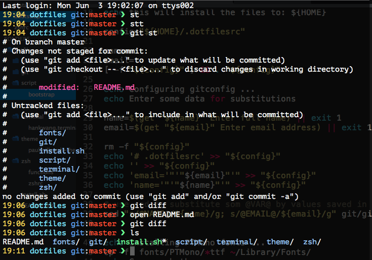

# Dotfiles

```bash
 ██░ ██  ▄▄▄       ███▄    █  ██ ▄█▀  ██████  █    ██ ▓█████▄  ▒█████
▓██░ ██▒▒████▄     ██ ▀█   █  ██▄█▒ ▒██    ▒  ██  ▓██▒▒██▀ ██▌▒██▒  ██▒
▒██▀▀██░▒██  ▀█▄  ▓██  ▀█ ██▒▓███▄░ ░ ▓██▄   ▓██  ▒██░░██   █▌▒██░  ██▒
░▓█ ░██ ░██▄▄▄▄██ ▓██▒  ▐▌██▒▓██ █▄   ▒   ██▒▓▓█  ░██░░▓█▄   ▌▒██   ██░
░▓█▒░██▓ ▓█   ▓██▒▒██░   ▓██░▒██▒ █▄▒██████▒▒▒▒█████▓ ░▒████▓ ░ ████▓▒░
 ▒ ░░▒░▒ ▒▒   ▓▒█░░ ▒░   ▒ ▒ ▒ ▒▒ ▓▒▒ ▒▓▒ ▒ ░░▒▓▒ ▒ ▒  ▒▒▓  ▒ ░ ▒░▒░▒░
 ▒ ░▒░ ░  ▒   ▒▒ ░░ ░░   ░ ▒░░ ░▒ ▒░░ ░▒  ░ ░░░▒░ ░ ░  ░ ▒  ▒   ░ ▒ ▒░
 ░  ░░ ░  ░   ▒      ░   ░ ░ ░ ░░ ░ ░  ░  ░   ░░░ ░ ░  ░ ░  ░ ░ ░ ░ ▒
 ░  ░  ░      ░  ░         ░ ░  ░         ░     ░        ░        ░ ░
                                                       ░
```

## Screenshot




## Setup

- **Shell**: zsh with [zinit](https://github.com/zdharma-continuum/zinit) plugin manager
- **Prompt**: [Starship](https://starship.rs/)
- **Terminal**: [Ghostty](https://ghostty.org/)
- **Editor**: [VS Code](https://code.visualstudio.com/) / Vim
- **Font**: [JetBrains Mono Nerd Font](https://www.nerdfonts.com/)

## Install

```bash
sudo softwareupdate -i -a
xcode-select --install

curl -L https://raw.github.com/hanksudo/dotfiles/master/install.sh | sh
```

## Set Git user info

```bash
git config --global user.signingkey XXXXXXX
git config --global user.email your-email-address
git config --global user.name "Your Name"
```

## macOS Settings

```bash
~/.dotfiles/macos
```

## CLI Tools

Managed via [Homebrew](https://brew.sh/) — see [Brewfile](./Brewfile) for the full list.

| Tool | Description |
|------|-------------|
| [autojump](https://github.com/joelthelion/autojump) | A faster way to navigate your filesystem (`j folderName`) |
| [bat](https://github.com/sharkdp/bat) | A `cat` clone with syntax highlighting and Git integration |
| [eza](https://github.com/eza-community/eza) | A modern replacement for `ls` |
| [fd](https://github.com/sharkdp/fd) | A simple, fast alternative to `find` |
| [fnm](https://github.com/Schniz/fnm) | Fast and simple Node.js version manager |
| [fzf](https://github.com/junegunn/fzf) | Command-line fuzzy finder |
| [git-extras](https://github.com/visionmedia/git-extras) | GIT utilities |
| [httpie](https://github.com/jakubroztocil/httpie) | A CLI HTTP client for humans |
| [ripgrep](https://github.com/BurntSushi/ripgrep) | Fast recursive search tool |
| [scmpuff](https://mroth.github.io/scmpuff/) | Numeric shortcuts for git filenames |
| [thefuck](https://github.com/nvbn/thefuck) | Corrects your previous console command |
| [tldr](https://github.com/tldr-pages/tldr) | Simplified man pages |
| [diff-so-fancy](https://github.com/so-fancy/diff-so-fancy) | Better looking git diffs |

## Applications

Managed via Homebrew Cask — see [Brewfile](./Brewfile) for the full list.

- [Ghostty](https://ghostty.org/) - Fast, native terminal emulator
- [IINA](https://iina.io/) - The modern media player for macOS
- [Notion](https://www.notion.so/) - All-in-one workspace
- [Raycast](https://www.raycast.com/) - Supercharged productivity

## Aliases & Functions

Git aliases are defined in [git/gitconfig](./git/gitconfig). Shell aliases and functions:

| Command | Description |
|---------|-------------|
| `cat` | Aliased to `bat` |
| `ls` | Aliased to `eza` |
| `lsd` | List only directories |
| `lsf` | List only files |
| `hosts` | Quick edit `/etc/hosts` |
| `sshc` | Quick edit `~/.ssh/config` |
| `emptytrash` | Empty the Trash on all mounted volumes |
| `ip` | Detect public IP |
| `localip` | Show local IP |
| `ips` | Show all IPv4 IPs |
| `ports` | List all listening ports (sudo required) |
| `whois` | Enhanced WHOIS lookups |
| `gz` | Get gzipped size |
| `extract` | Extract archives — `extract <file>` |
| `mkcd` | Make directory and cd into it |
| `pip-purge` | Purge all Python3 packages |
| `image` | Search on Google Image |
| `map` | Search on Google Map |
| `weather` | Show weather |
| `serve` | Serve static files |
| `fbr` | Checkout git branch with fzf (including remote) |
| `fco` | Checkout git branch/tag with fzf |
| `fcoc` | Checkout git commit with fzf |
| `fshow` | Git commit browser with fzf |
| [zmv](http://zshwiki.org/home/builtin/functions/zmv) | Massive file rename |

## Export existing packages

```bash
# VSCode extensions
code --list-extensions > vscode.extensions

# npm packages
npm ls -g --depth=0

# dump homebrew package list
brew bundle dump -f
```

## Command lines for fun

```bash
fortune
sl
cowsay お元気ですか？
```

## References

- [GitHub does dotfiles - dotfiles.github.io](https://dotfiles.github.io/)
- [GitHub - drduh/macOS-Security-and-Privacy-Guide](https://github.com/drduh/macOS-Security-and-Privacy-Guide)
- [GitHub - jlevy/the-art-of-command-line](https://github.com/jlevy/the-art-of-command-line)
